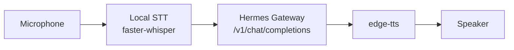

# Hermes Voice Community

[中文介绍](README.zh-CN.md)


**A local voice desktop widget that lets your Hermes talk back.**

Hermes Voice Community is the Basic community edition of Hermes Voice. Hold to talk, transcribe locally, send the text to your Hermes Gateway, and hear the response through edge-tts.

It is built for people who already run a local Hermes, agent, or LLM gateway and want a simple desktop voice entrance.

<p align="center">
  
  
</p>

## 30-Second Overview



You speak into the desktop widget. The app turns your voice into text locally, sends it to your Hermes Gateway, then reads the answer back.

## Why This Exists

- Give local Hermes users a real desktop voice entry point.
- Keep the Basic edition easy to read, run, and extend.
- Provide a clean Gateway contract instead of locking users into one backend.
- Let the full product edition keep advanced experience, packaging, and release work separate.

## What Is Included

- Desktop floating voice widget
- Push-to-talk recording
- Local STT with faster-whisper
- Hermes Gateway integration
- Voice playback with edge-tts
- Basic settings panel
- First-run diagnostics
- System tray entry
- Local logs
- Audio device checks
- Gateway connection test script

## What Is Not Included

- Product-grade app packaging workflow
- Advanced floating widget interactions
- Hands-free mode
- Wake word flow
- Performance profiles
- Deep GPU optimization
- Store publishing, code signing, or release workflow
- Cross-platform distribution support

## Quick Start

Install dependencies:

```powershell
.\scripts\setup.ps1
```

Ask your local Hermes to provide a compatible Gateway. If you do not know the key, follow the [Local Hermes Guide zh-CN](docs/LOCAL_HERMES_GUIDE.zh-CN.md).

Test the Gateway:

```powershell
.\scripts\test_gateway.ps1
```

Start the desktop app:

```powershell
.\scripts\start.ps1
```

If your Gateway uses a custom URL or key:

```powershell
$env:HERMES_GATEWAY_URL="http://127.0.0.1:8642"
$env:API_SERVER_KEY="your-hermes-gateway-key"
.\scripts\start.ps1
```

## Requirements

- Windows 10/11
- Python 3.11+
- `ffmpeg` and `ffplay` available in PATH
- A local Hermes Gateway compatible with `POST /v1/chat/completions`

## Gateway Contract

Hermes Voice Community expects your local Hermes Gateway to provide:

- `GET /v1/models`
- `POST /v1/chat/completions`
- OpenAI-style `messages`
- response content at `choices[0].message.content`
- optional `Authorization: Bearer <API_SERVER_KEY>`

Details:

- [Hermes Gateway Integration](docs/HERMES_GATEWAY.md)
- [Local Hermes Guide zh-CN](docs/LOCAL_HERMES_GUIDE.zh-CN.md)
- [Architecture](docs/ARCHITECTURE.md)

## Local Endpoints

After startup:

- UI: `http://127.0.0.1:8765`
- Health: `http://127.0.0.1:8765/health`
- Status: `http://127.0.0.1:8765/api/status`
- Audio devices: `http://127.0.0.1:8765/api/devices`

## Configuration

User settings are stored at:

```text
%LOCALAPPDATA%\HermesVoiceWidget\settings.json
```

Logs and model cache:

```text
%LOCALAPPDATA%\HermesVoiceWidget\logs\app.log
%LOCALAPPDATA%\HermesVoiceWidget\models
```

Common environment variables:

| Variable | Default | Description |
| --- | --- | --- |
| `VOICE_WIDGET_HOST` | `127.0.0.1` | Local backend host |
| `VOICE_WIDGET_PORT` | `8765` | Local backend port |
| `HERMES_GATEWAY_URL` | `http://127.0.0.1:8642` | Hermes Gateway URL |
| `API_SERVER_KEY` | empty | Hermes Gateway auth key |
| `VOICE_STT_MODEL` | `base` | faster-whisper model |
| `VOICE_STT_LANG` | `zh` | STT language |
| `VOICE_USE_CUDA` | empty | Set to `1` to try CUDA |
| `VOICE_TTS_VOICE` | `zh-CN-XiaoxiaoNeural` | edge-tts voice |

## Documentation

- [Usage Guide](docs/USAGE.md)
- [Configuration](docs/CONFIGURATION.md)
- [Hermes Gateway Integration](docs/HERMES_GATEWAY.md)
- [Local Hermes Guide zh-CN](docs/LOCAL_HERMES_GUIDE.zh-CN.md)
- [Architecture](docs/ARCHITECTURE.md)
- [Community Edition Scope](docs/COMMUNITY_EDITION.md)
- [Contributing](CONTRIBUTING.md)
- [Security](SECURITY.md)
- [Support](SUPPORT.md)
- [License Status](LICENSE.md)

## License

This repository uses a custom source-available, non-commercial license. See [LICENSE.md](LICENSE.md).
