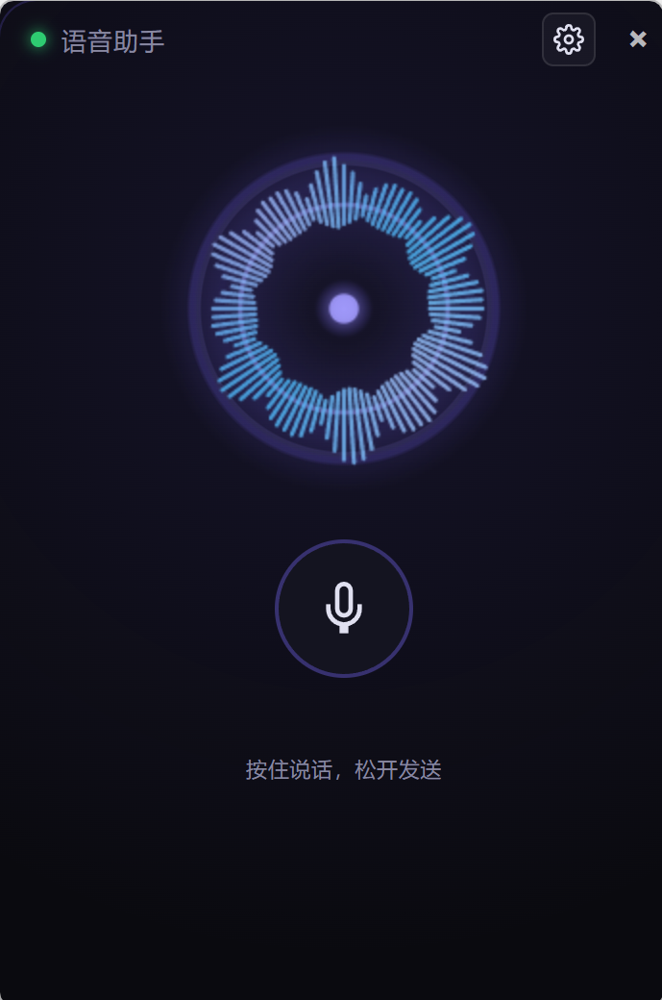
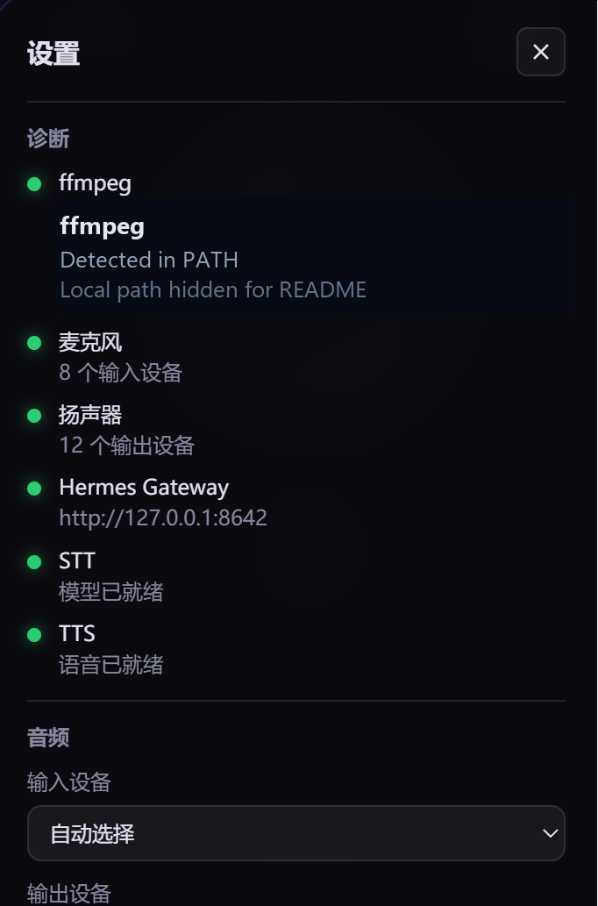
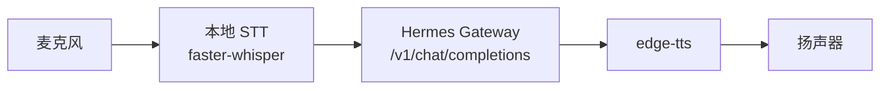

# Hermes Voice Community


**让你的本地 Hermes 开口说话的桌面语音悬浮窗。**

Hermes Voice Community 是 Hermes Voice 的 Basic 社区版：你按住说话，它在本地完成语音识别，把文字交给你的 Hermes Gateway，再把 Hermes 的回复读出来。

它适合已经有本地 Hermes、Agent 或 LLM Gateway 的用户，用来快速获得一个可运行的桌面语音入口。

<p align="center">
  
  
</p>

## 30 秒看懂



你对着桌面悬浮窗说话，程序在本地识别语音，把文本发给你的 Hermes Gateway，然后自动播放 Hermes 的回复。

## 为什么做这个

- 给本地 Hermes 用户一个真正能用的桌面语音入口。
- 让 Basic 社区版保持简单、可读、可运行。
- 用清晰的 Gateway 协议接入不同后端，而不是绑定某一个服务。
- 本仓库的功能范围以当前代码和文档为准。

## 已包含

- 桌面悬浮语音窗口
- 按住说话
- 本地 STT 语音识别
- Hermes Gateway 对接
- edge-tts 语音播放
- 基础设置页
- 首次启动诊断
- 系统托盘
- 本地日志
- 音频设备检查
- Gateway 连通测试脚本

## 快速开始

安装依赖：

```powershell
.\scripts\setup.ps1
```

让你的本地 Hermes 提供一个兼容 Gateway。如果你不知道 `API_SERVER_KEY` 是什么，把 [让你的本地 Hermes 接入 Community 版](docs/LOCAL_HERMES_GUIDE.zh-CN.md) 里的任务说明复制给它。

测试 Gateway：

```powershell
.\scripts\test_gateway.ps1
```

启动桌面版：

```powershell
.\scripts\start.ps1
```

如果你的 Gateway 地址或 key 不是默认值：

```powershell
$env:HERMES_GATEWAY_URL="http://127.0.0.1:8642"
$env:API_SERVER_KEY="your-hermes-gateway-key"
.\scripts\start.ps1
```

## 环境要求

- Windows 10/11
- Python 3.11+
- `ffmpeg` 和 `ffplay` 已加入 PATH
- 一个兼容 `POST /v1/chat/completions` 的本地 Hermes Gateway

## Gateway 要求

Hermes Voice Community 需要你的本地 Hermes Gateway 提供：

- `GET /v1/models`
- `POST /v1/chat/completions`
- OpenAI 风格的 `messages`
- 在 `choices[0].message.content` 返回回复内容
- 可选的 `Authorization: Bearer <API_SERVER_KEY>`

详细说明：

- [Hermes Gateway 接入](docs/HERMES_GATEWAY.md)
- [让你的本地 Hermes 接入 Community 版](docs/LOCAL_HERMES_GUIDE.zh-CN.md)
- [架构说明](docs/ARCHITECTURE.md)

## 本地接口

启动后：

- UI: `http://127.0.0.1:8765`
- 健康检查: `http://127.0.0.1:8765/health`
- 诊断状态: `http://127.0.0.1:8765/api/status`
- 音频设备: `http://127.0.0.1:8765/api/devices`

## 常用配置

用户设置保存在：

```text
%LOCALAPPDATA%\HermesVoiceWidget\settings.json
```

日志和模型缓存：

```text
%LOCALAPPDATA%\HermesVoiceWidget\logs\app.log
%LOCALAPPDATA%\HermesVoiceWidget\models
```

常用环境变量：

| 变量 | 默认值 | 说明 |
| --- | --- | --- |
| `VOICE_WIDGET_HOST` | `127.0.0.1` | 本地后端监听地址 |
| `VOICE_WIDGET_PORT` | `8765` | 本地后端端口 |
| `HERMES_GATEWAY_URL` | `http://127.0.0.1:8642` | Hermes Gateway 地址 |
| `API_SERVER_KEY` | 空 | Hermes Gateway 鉴权密钥 |
| `VOICE_STT_MODEL` | `base` | faster-whisper 模型 |
| `VOICE_STT_LANG` | `zh` | 识别语言 |
| `VOICE_USE_CUDA` | 空 | 设为 `1` 时尝试 CUDA |
| `VOICE_TTS_VOICE` | `zh-CN-XiaoxiaoNeural` | edge-tts 声音 |

## 文档

- [使用说明](docs/USAGE.md)
- [配置说明](docs/CONFIGURATION.md)
- [Hermes Gateway 接入](docs/HERMES_GATEWAY.md)
- [让你的本地 Hermes 接入 Community 版](docs/LOCAL_HERMES_GUIDE.zh-CN.md)
- [架构说明](docs/ARCHITECTURE.md)
- [社区版边界](docs/COMMUNITY_EDITION.md)
- [贡献说明](CONTRIBUTING.md)
- [安全说明](SECURITY.md)
- [支持方式](SUPPORT.md)
- [协议说明](LICENSE.md)

## 作者

作者：**请叫我奉孝大人**

- GitHub：[@SamuelKwj](https://github.com/SamuelKwj)
- 抖音号：`52168570433`
- 相关项目：[PenMoji Content Copilot](https://github.com/SamuelKwj/PenMoji-content-copilot)

## 协议

本仓库使用自定义 Source-Available Non-Commercial License。

简单说：

- 可以看源码、学习、非商业本地运行、非商业修改、提交 issue 或 PR
- 不允许商用、售卖、再分发、托管成服务，或基于它制作商业竞品
- 商业使用需要获得作者书面许可

详见 [LICENSE.md](LICENSE.md)。
