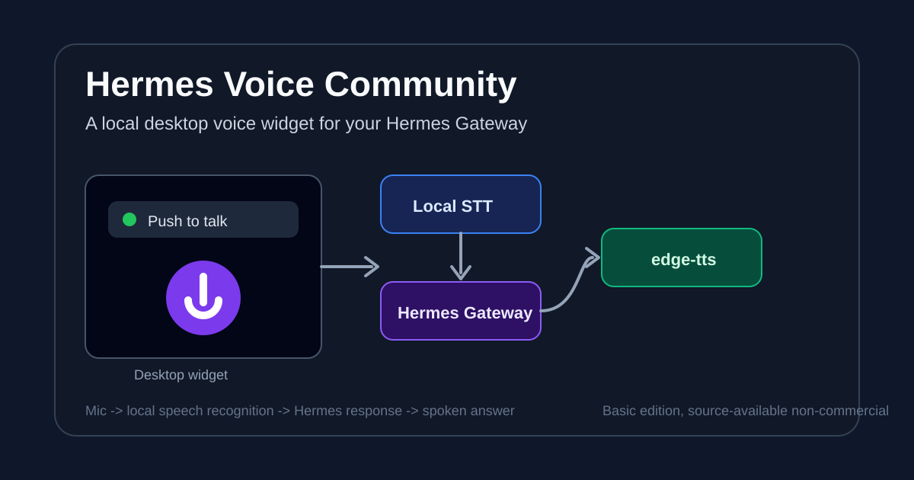
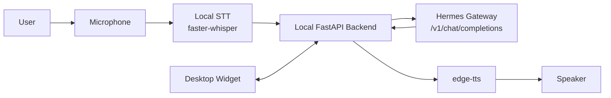

# Architecture

Hermes Voice Community is intentionally small. It has one job: turn local speech into a text request for Hermes Gateway, then play the answer back.

## Components

| Component | Role |
| --- | --- |
| `frontend/` | Floating desktop widget UI. |
| `launcher.py` | Starts the desktop WebView shell. |
| `backend/server.py` | Local FastAPI API used by the UI. |
| `backend/stt_engine.py` | Local speech-to-text using faster-whisper. |
| `backend/hermes_client.py` | Sends chat requests to Hermes Gateway. |
| `backend/tts_engine.py` | Plays responses with edge-tts and ffplay. |
| `scripts/test_gateway.ps1` | Checks whether a Gateway is compatible. |

## Runtime Flow

1. User holds the talk button.
2. The widget records audio.
3. The backend sends audio to local STT.
4. Transcribed text is sent to Hermes Gateway.
5. Gateway returns `choices[0].message.content`.
6. The backend sends the reply to edge-tts.
7. Audio is played through the local speaker.

## Gateway Boundary

The Gateway is deliberately external. Users can connect their own local Hermes implementation as long as it supports:

- `GET /v1/models`
- `POST /v1/chat/completions`
- response text at `choices[0].message.content`
- optional Bearer authentication

The community edition does not provide a hosted Gateway or a built-in commercial backend.
